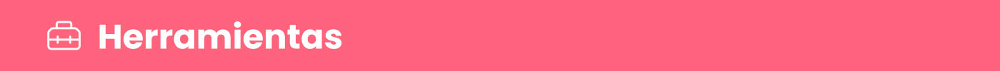
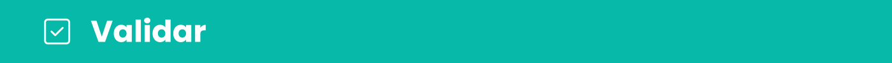
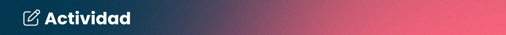
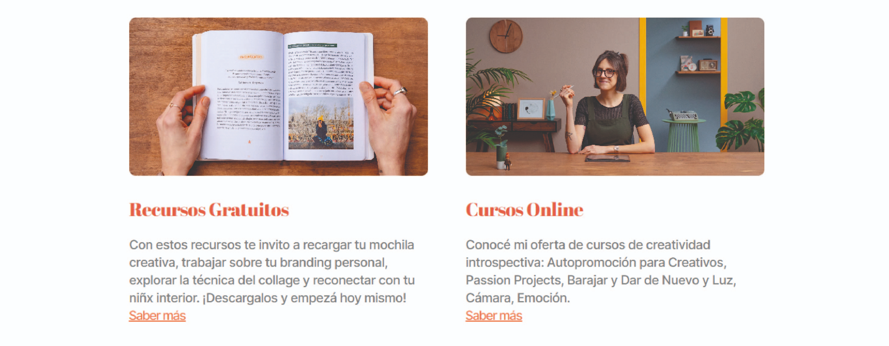

# clase_06
# 🏠 Paso 16 - ¡Puesta a punto de tu sitio!


## 👋 ¡Bienvenido a tu siguiente paso! 
¡Hola! Seguimos avanzando 👟

```

Hasta aquí hemos visto varios puntos claves en cuanto a HTML y CSS. Vimos cómo crear elementos semánticos como <section> y elementos no semánticos como <div>. Vimos cómo organizar elementos con CSS utilizando display:flex; pero también cómo podemos modificar el comportamiento de los elementos en bloque y en línea. 

Además conocemos el modelo de cajas, que muestra que cada elemento está compuesto por márgenes, bordes, paddings y contenido y que podemos modificar estos valores desde CSS para, por ejemplo, espaciar elementos. 

En los siguientes pasos vamos a aprovechar estos conocimientos para dejar el sitio listo. 

Vamos 🚀

```

En esta oportunidad queremos traer la siguiente herramienta para que puedan utilizar en su sitio: 

Utilizar fuentes externas de https://fonts.google.com/ 

¿Cómo agregar una fuente?
https://youtu.be/mPrMcsFvZz4


Asegúrate de:

Ver el tip sobre Google Fonts y probarlo en tu sitio web. 

# 👣 Paso 17 - ¡Definiendo el CSS!


## 👋 ¡Bienvenido a tu siguiente paso! 
Llegó el momento de organizar nuestro sitio con CSS y aplicar lo aprendido hasta ahora!

¡Continuemos! 🚀



## Actividad - Puliendo el CSS
El objetivo de esta actividad es poder tomarse el tiempo para agregar el CSS necesario para dejar listo su sitio web. 

➕ Referencia de cómo debería verse la estructura del sitio

Les dejamos la siguiente referencia de cómo podría verse la estructura del sitio. ¡Recuerden que como bien mencionamos, es una referencia y no necesariamente tiene que quedar igual, pueden darle su propio estilo, colores y orden! 


¿Cómo logro esto?

Te dejamos un video para poder orientarte en el armado del CSS
https://youtu.be/x2fcpnkJKAg

💡 Es momento de aplicar estilos en tu sitio. Comparte con tus compañeros cómo va quedando tu web, aprovecha a ver las dudas con la mesa o el coach.

# 👣 Paso 18 - Agregando elementos al sitio

## 👋 ¡Bienvenido a tu siguiente paso! 
Llegó el momento de agregar más elementos a nuestro sitio y agregar el CSS necesario para poder completarlo.


## Actividad - Continuamos armando el sitio web
Aprovechemos lo aprendido hasta acá sobre html y css para continuar agregando contenido a nuestra página web. 

Tomando como referencia la web que vimos https://www.minicarbono.com/ les proponemos replicar el siguiente diseño en su web, tanto el HTML como el CSS:



¿Qué pueden colocar en estas tarjetas?

Si tienes trabajos previos realizados, puedes poner una imagen de estos proyectos con su título, texto y detalle. Sino, puedes imaginar qué proyectos quisieras crear a futuro o colocar ciertos gustos como comida preferida o peli! Dejen volar su imaginación! ☁️

💡 Recuerden que existen muchas propiedades de CSS que podemos aplicar, entre ellas el border-radius (que usamos por ejemplo para redondear el borde de la imagen). Pueden ver más sobre esta propiedad en el siguiente link 👉border-radius 

📌 Para tener en cuenta: el estilo de las cajas es igual en ambas. Se componen de una imagen, un título, una descripción y un botón de saber más. ¿Cómo harían para reutilizar el estilo y no tener que escribirlo más de una vez en css?


➕ Referencia de cómo podría verse la estructura del sitio


💡 Es momento de aplicar estilos en tu sitio. Comparte con tus compañeros cómo va quedando tu web, aprovecha a ver las dudas con la mesa o el coach